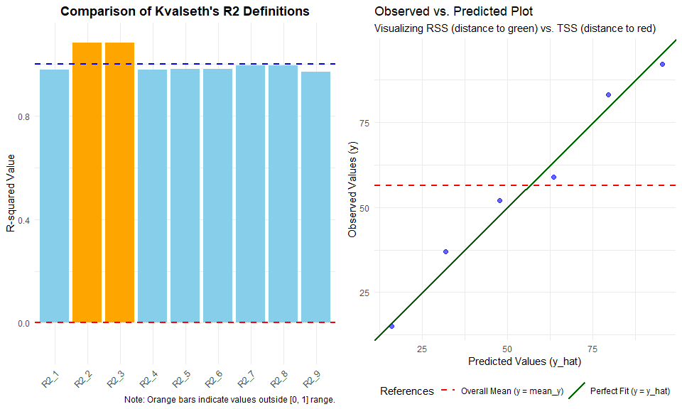
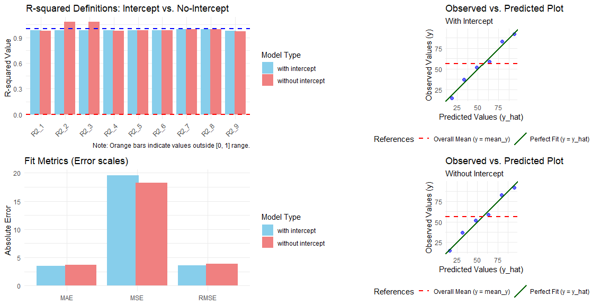

<!-- README.md is generated from README.Rmd. Please edit that file -->

# kvr2: Educational Tool for Exploring $R^2$ Definitions

<!-- badges: start -->

[](https://CRAN.R-project.org/package=kvr2)
<!-- badges: end -->

The `kvr2` package provides functions to calculate nine types of
coefficients of determination ($R^2$) as classified by **Kvalseth
(1985)**.

## Overview

The coefficient of determination, $R^2$, is one of the most common
metrics for assessing model fit. However, its mathematical definition is
not unique. While various formulas yield identical results in standard
linear regression with an intercept, they can diverge
significantly—sometimes producing negative values or values exceeding
1—when applied to:

- **Models without an intercept** (No-intercept models)
- **Power regression models**
- **Other fits via transformations** (e.g., log-log models)

## Scope and Compatibility

This package is specifically designed for models that can be represented
as `lm` objects in R. This includes:

- **Standard Linear Models** (with an intercept)
- **No-intercept Models** (e.g., `lm(y ~ x - 1)`)
- **Power Regression Models** (fitted via log-transformation, such as
  `lm(log(y) ~ log(x))`)

**Note:** This package does **not** support general non-linear least
squares (`nls`) or other complex non-linear modeling frameworks. It
focuses on the mathematical sensitivity of $R^2$ within the context of
linear estimation and its common transformations.

## Educational Purpose: Demystifying

The primary goal of `kvr2` is **not** to provide a definitive “best” for
every scenario, but to serve as an educational and diagnostic resource.
Many users rely on the single value provided by standard software, but
as this package demonstrates, that value is sensitive to the underlying
mathematical definition and the software’s internal defaults.

Through this package, users can:

- **Understand Mathematical Sensitivity**: Observe firsthand how
  different algebraic formulas (eight + one definitions) can lead to
  dramatically different interpretations of the same model fit,
  especially in non-intercept models.
- **Diagnose Negative**: It is imperative to acknowledge that a negative
  (typically in) should not be interpreted as a “bug”; rather, it
  functions as a critical diagnostic signal. This signal indicates that
  the model predicts outcomes that fall below the mean of a simple
  horizontal line.
- **Evaluate Robustness and Transformations**: Explore Kvalseth’s
  recommendations for using for consistency and for robustness against
  outliers, and see how behaves when models are fitted in transformed
  spaces (e.g., log power regression models).

## Formulas Included

The package calculates nine indices based on Kvalseth (1985):

- **$R^2_1$** to **$R^2_8$**: A classification of existing and
  historical formulas used in statistical literature and software.
- **$R^2_9$**: A robust version of the coefficient of determination
  based on median absolute deviations, as proposed in the original
  paper.

------------------------------------------------------------------------

## Installation

You can install the released version of `kvr2` from CRAN with:

``` r
install.packages("kvr2")
```

You can install the development version of `kvr2` like so:

``` r
remotes::install_github("indenkun/kvr2")
```

## Usage and Examples

`kvr2` provides a simple way to observe how different $R^2$ definitions
behave across various model specifications.

### 1. Basic Usage: Consistency and Divergence

In standard linear models with an intercept, most $R^2$ definitions
yield identical results. However, they can diverge significantly in
models without an intercept or in power regression models.

``` r
library(kvr2)

# Dataset from Kvalseth (1985)
df1 <- data.frame(x = 1:6, y = c(15, 37, 52, 59, 83, 92))

# Case A: Linear regression with intercept (Values are consistent)
model_int <- lm(y ~ x, data = df1)
r2(model_int)
#> R2_1 :  0.9808 
#> R2_2 :  0.9808 
#> R2_3 :  0.9808 
#> R2_4 :  0.9808 
#> R2_5 :  0.9808 
#> R2_6 :  0.9808 
#> R2_7 :  0.9966 
#> R2_8 :  0.9966 
#> R2_9 :  0.9778 
#> ---------------------------------
#> (Type: linear, with intercept, n: 6, k: 2)

# Case B: Linear regression without intercept (Values diverge)
model_no_int <- lm(y ~ x - 1, data = df1)
results <- r2(model_no_int)
results
#> R2_1 :  0.9777 
#> R2_2 :  1.0836 
#> R2_3 :  1.0830 
#> R2_4 :  0.9783 
#> R2_5 :  0.9808 
#> R2_6 :  0.9808 
#> R2_7 :  0.9961 
#> R2_8 :  0.9961 
#> R2_9 :  0.9717 
#> ---------------------------------
#> (Type: linear, without intercept, n: 6, k: 1)
```

**Observation:** In Case B, notice that $R^2_2$ and $R^2_3$ exceed 1.0.
This demonstrates why choosing the correct definition is critical for
models without an intercept.

### 2. Accessing Calculated Values

The `r2()` function returns a list object. While the output is formatted
for readability, you can easily access individual values for further
analysis or reporting.

``` r
# Accessing specific R2 values from the result object
results$r2_1
#>      r2_1 
#> 0.9776853

results$r2_9
#>      r2_9 
#> 0.9717156

# You can also use it in your custom functions or data frames
my_val <- results$r2_1
```

### 3. Visualizing the Sensitivity of R-squared

To better understand the divergence between these definitions, the
`kvr2` package provides a specialized plotting function. When you apply
`plot_kvr2()` to your model, it displays both the comparison of $R^2$
definitions and a diagnostic observed-vs-predicted plot.

``` r
# Example with the forced no-intercept model
plot_kvr2(model_no_int)
```



In the resulting side-by-side plot:

- **Left Panel**: Shows which definitions are most affected by the
  intercept constraint.

- **Right Panel**: Reveals if the model (green line) is performing worse
  than the simple average (red line).

### 4. Model Comparison with Error Metrics

To complement $R^2$ analysis, use `comp_fit()` to evaluate models via
standard error metrics such as RMSE, MAE, and MSE.

``` r
comp_fit(model_no_int)
#> RMSE :  3.9008 
#> MAE :  3.6520 
#> MSE :  18.2593 
#> ---------------------------------
#> (Type: linear, without intercept, n: 6, k: 1)
```

For details, refer to the documentation for each function.

### 5. Direct Comparison of Constraints

The `comp_model()` function allows you to instantly see the impact of
the intercept constraint. In the example below, notice how $R^2_2$
remains misleadingly high in the no-intercept model, whereas $R^2_1$
drops, reflecting the true decrease in predictive accuracy relative to
the mean.

``` r
res_comp <- comp_model(model_no_int)
res_comp
#> model             |   R2_1 |   R2_2 |   R2_3 |   R2_4 |   R2_5 |   R2_6
#> -----------------------------------------------------------------------
#> with intercept    | 0.9808 | 0.9808 | 0.9808 | 0.9808 | 0.9808 | 0.9808
#> without intercept | 0.9777 | 1.0836 | 1.0830 | 0.9783 | 0.9808 | 0.9808
#> 
#> model             |   R2_7 |   R2_8 |   R2_9 |   RMSE |    MAE |     MSE
#> ------------------------------------------------------------------------
#> with intercept    | 0.9966 | 0.9966 | 0.9778 | 3.6165 | 3.5238 | 19.6190
#> without intercept | 0.9961 | 0.9961 | 0.9717 | 3.9008 | 3.6520 | 18.2593
#> ---------------------------------
#> 
#> Note: Some R2 values exceed 1.0 or are negative, indicating that these definitions may be inappropriate for the no-intercept model.
```

The power of `kvr22` lies in its ability to visually demonstrate **why**
certain $R^2$ definitions fail when an intercept is removed. By calling
`plot()` on a `comp_model` object, you generate a comprehensive **2x2
Diagnostic Dashboard**.

``` r
# Generate the dashboard
plot(res_comp)
```



#### What the dashboard reveals:

- **R-squared Comparison (Top-Left)**: Side-by-side bars for all 9
  definitions. Orange bars instantly flag “illegal” values (e.g.,
  $R^2 > 1$ or $R^2 < 0$), which are common in no-intercept models.
- **Fit Metrics (Bottom-Left)**: Direct comparison of RMSE, MAE, and MSE
  to see the actual error trade-off.
- **Diagnostic Plots (Right Column)**: Observed vs. Predicted scatter
  plots.
- The **Green line** represents a perfect fit ($y = \hat{y}$).
- The **Red dashed line** represents the global mean ($y = \bar{y}$).
- If the data points are closer to the red line than the green line,
  $R^2_1$ will be negative—a clear visual proof of model poorness.

> **Note**: This dashboard is built using the `grid` system. While it
> provides a complete overview, it cannot be modified with `ggplot2`’s
> `+` operator. For customized single plots, use
> `plot_kvr2(model, plot_type = "r2")` or `plot_diagnostic(model)`.

## References

Kvalseth, T. O. (1985). Cautionary Note about $R^2$. The American
Statistician, 39(4), 279-285. [DOI:
10.1080/00031305.1985.10479448](https://doi.org/10.1080/00031305.1985.10479448)
